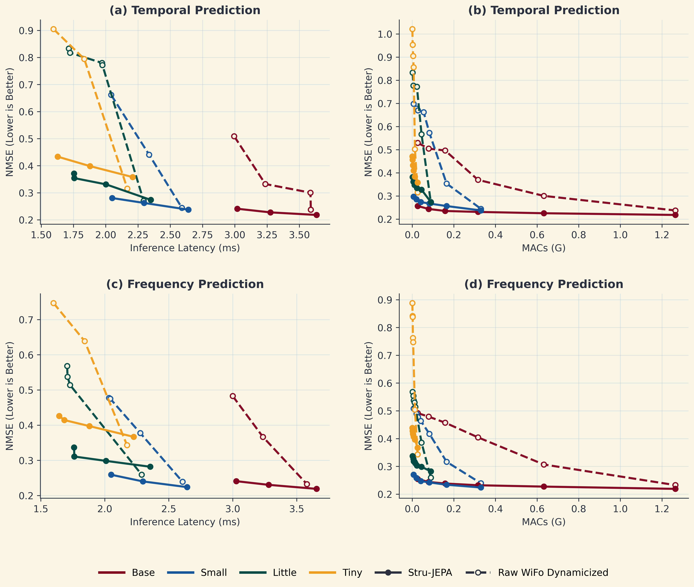
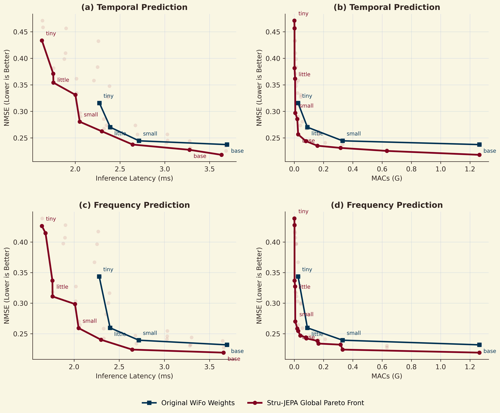

# StruJEPA

StruJEPA is a structure-aware elastic training method for transformer backbones. This repository contains a reusable elastic training framework together with a full WiFo integration, retained checkpoints, and analysis artifacts used to study the latency/compute/performance trade-off of elastic subnets.

The current public snapshot focuses on the WiFo case study:

- `elastic_method/`
  - reusable elasticization, subnet extraction, masking, and alignment components
- `WIFO/`
  - WiFo model code, StruJEPA training entrypoints, evaluation scripts, plotting scripts, and references
- `runs/`
  - retained logs, checkpoints, CSV summaries, and final trade-off figures

## What Is Included

- StruJEPA elastic training support for WiFo
- WiFo-specific recipe trainer and data loading pipeline
- Evaluation scripts for:
  - retained subnet checkpoints
  - dynamicized raw WiFo baselines
  - latency-performance and MACs-performance trade-off curves
- Unit tests for the generic elastic framework and the WiFo integration
- A cleaned set of key experiment outputs instead of the full intermediate experiment history

## Repository Layout

### Core framework

- `elastic_method/core/`
  - elastic wrapper, subnet structures, runtime utilities, and elastic operators
- `elastic_method/adapters/`
  - adapters for WiFo, timm ViT, HuggingFace backbones, and toy encoders
- `elastic_method/method/`
  - generic masking and alignment trainer logic
- `elastic_method/tests/`
  - framework and WiFo integration tests

### WiFo integration

- `WIFO/src/model.py`
  - WiFo backbone implementation with elastic support
- `WIFO/src/elastic_wifo.py`
  - WiFo elasticization entrypoint
- `WIFO/src/strujepa_main.py`
  - main training entry for StruJEPA on WiFo
- `WIFO/src/strujepa_recipe_trainer.py`
  - WiFo-specific training recipe
- `WIFO/src/strujepa_wifo.py`
  - WiFo StruJEPA task definition
- `WIFO/src/strujepa_data.py`
  - WiFo dataset loading for mixed D1-D16 training
- `WIFO/src/analyze_tradeoff.py`
  - trade-off analysis and table generation
- `WIFO/src/plot_tradeoff_with_raw_dynamic.py`
  - per-size comparison plot with dynamicized raw WiFo baselines
- `WIFO/src/plot_tradeoff_global_pareto.py`
  - global Pareto-front visualization
- `WIFO/reference/`
  - reference PDFs used during implementation and result comparison

### Retained outputs

- `runs/analysis_tradeoff_5ep_compare_20260414_153000/`
  - main figures, CSVs, markdown summaries, and timing stats
- `runs/wifo_base_strujepa_gpu0_anchor_random_20260412_223720/`
  - retained 5-epoch random-subnet base checkpoint and logs
- `runs/wifo_small_strujepa_gpu0_anchor_random_20260413_103234/`
  - retained 5-epoch random-subnet small checkpoint and logs
- `runs/wifo_little_strujepa_gpu1_anchor_random_20260413_103234/`
  - retained 5-epoch random-subnet little checkpoint and logs
- `runs/wifo_tiny_strujepa_gpu1_anchor_random_20260413_111721/`
  - retained 5-epoch random-subnet tiny checkpoint and logs

## Local Assets Not Tracked By Git

The local working directory used for development contains large assets that are intentionally excluded from version control:

- `WIFO/dataset/`
- `WIFO/dataset4train/`
- `WIFO/weights/`

This repository therefore contains code, retained results, and StruJEPA checkpoints, but not the full WiFo training datasets or the original pretrained WiFo weight pack.

## Environment Setup

Install dependencies from the WiFo integration directory:

```bash
pip install -r WIFO/requirements.txt
```

Typical dependencies used in this project include:

- `torch`
- `numpy`
- `scipy`
- `hdf5storage`
- `matplotlib`

## Expected Data Layout

The scripts assume the following local structure:

```text
StruJEPA/
├── WIFO/
│   ├── dataset/
│   ├── dataset4train/
│   ├── weights/
│   └── src/
├── elastic_method/
└── runs/
```

For WiFo experiments:

- `dataset4train/` is used for training and validation data
- `dataset/` is used for evaluation on the retained test split
- `weights/` stores the original WiFo pretrained checkpoints such as `wifo_base.pkl`

## Training

### Example: train StruJEPA on WiFo

```bash
python WIFO/src/strujepa_main.py \
  --dataset D1*D2*D3*D4*D5*D6*D7*D8*D9*D10*D11*D12*D13*D14*D15*D16 \
  --train_data_root /abs/path/to/WIFO/dataset4train \
  --val_data_root /abs/path/to/WIFO/dataset4train \
  --file_load_path /abs/path/to/WIFO/weights/wifo_base.pkl \
  --size base \
  --batch_size 8 \
  --epochs 5 \
  --width_multipliers 1.0,0.5,0.125 \
  --depth_multipliers 1.0,0.5,0.166667
```

Important recipe defaults in the current WiFo setup:

- mixed WiFo masking tasks:
  - `random`
  - `temporal`
  - `fre`
- random-subnet anchor training
- EMA teacher
- output alignment and representation alignment

## Evaluation And Analysis

### Run WiFo integration tests

```bash
python -m unittest elastic_method.tests.test_wifo_vit
python -m unittest elastic_method.tests.test_wifo_strujepa
python -m unittest elastic_method.tests.test_trainer_smoke
```

### Re-generate trade-off analysis

```bash
python WIFO/src/analyze_tradeoff.py
python WIFO/src/plot_tradeoff_with_raw_dynamic.py
python WIFO/src/plot_tradeoff_global_pareto.py
python WIFO/src/plot_training_loss.py
```

### Retained result files

Key artifacts in `runs/analysis_tradeoff_5ep_compare_20260414_153000/` include:

- `tradeoff_2x2.png`
- `tradeoff_2x2_global_pareto.png`
- `raw_size_tradeoff.csv`
- `raw_dynamic_size_tradeoff.csv`
- `strujepa_size_tradeoff.csv`
- `paper_plus_strujepa_tables.md`
- `training_speed.json`

## Main Figures

### Per-size trade-off comparison

This figure compares StruJEPA-enhanced WiFo subnets against dynamicized raw WiFo baselines for each retained model size.



### Global Pareto front

This figure shows the global Pareto front after merging StruJEPA subnets from all retained model sizes.



## Notes On The Public Snapshot

- This repository keeps the key 5-epoch StruJEPA checkpoints because they are directly used by the retained comparison figures.
- Intermediate failed runs, redundant logs, and temporary plotting outputs were removed before release.
- One retained checkpoint is larger than GitHub's recommended 50 MB threshold, but still below the hard 100 MB file limit.

## Citation

If you use this repository, please cite the original WiFo work and cite StruJEPA according to your corresponding paper or report.
